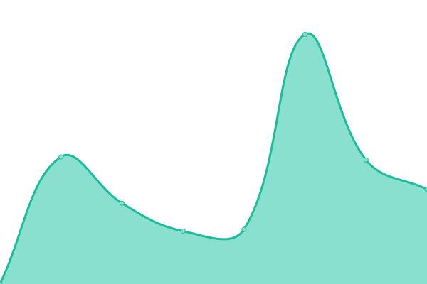
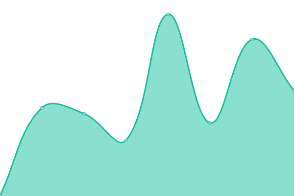
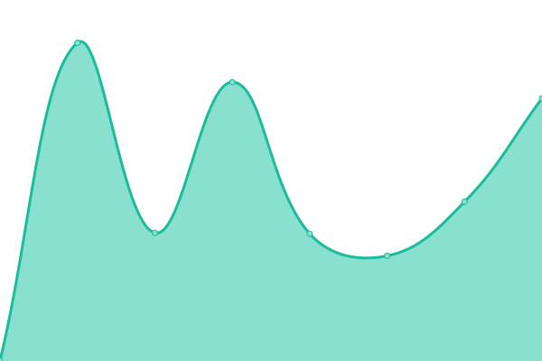

# [📈 Live Status](https://uptime.celestia.elmenu.tn): <!--live status--> **🟧 Partial outage**

This repository contains the open-source uptime monitor and status page for [Adam ABICHOU](https://adam.abichou.tn), powered by [Upptime](https://github.com/upptime/upptime).

With [Upptime](https://upptime.js.org), you can get your own unlimited and free uptime monitor and status page, powered entirely by a GitHub repository. We use [Issues](https://github.com/adamab48/celestia-uptime/issues) as incident reports, [Actions](https://github.com/adamab48/celestia-uptime/actions) as uptime monitors, and [Pages](https://uptime.celestia.elmenu.tn) for the status page.

<!--start: status pages-->
<!-- This summary is generated by Upptime (https://github.com/upptime/upptime) -->
<!-- Do not edit this manually, your changes will be overwritten -->
<!-- prettier-ignore -->
| URL | Status | History | Response Time | Uptime |
| --- | ------ | ------- | ------------- | ------ |
|  [ADMIN-API PROD](https://admin-api.prod.celestia.elmenu.tn/health) | 🟩 Up | [admin-api-prod.yml](https://github.com/adamab48/celestia-uptime/commits/HEAD/history/admin-api-prod.yml) | 

 352ms
     
 | 

<a href="https://uptime.celestia.elmenu.tn/history/admin-api-prod">100.00%</a>
    

|  [ADMIN-API STAGING](https://admin-api.staging.celestia.elmenu.tn/health) | 🟥 Down | [admin-api-staging.yml](https://github.com/adamab48/celestia-uptime/commits/HEAD/history/admin-api-staging.yml) | 

 4623ms
     
 | 

<a href="https://uptime.celestia.elmenu.tn/history/admin-api-staging">99.33%</a>
    

|  [ADMIN-UI PROD](https://admin-ui.prod.celestia.elmenu.tn) | 🟩 Up | [admin-ui-prod.yml](https://github.com/adamab48/celestia-uptime/commits/HEAD/history/admin-ui-prod.yml) | 

 170ms
     
 | 

<a href="https://uptime.celestia.elmenu.tn/history/admin-ui-prod">100.00%</a>
    

|  [ADMIN-UI STAGING](https://admin-ui.staging.celestia.elmenu.tn) | 🟩 Up | [admin-ui-staging.yml](https://github.com/adamab48/celestia-uptime/commits/HEAD/history/admin-ui-staging.yml) | 

 210ms
     
 | 

<a href="https://uptime.celestia.elmenu.tn/history/admin-ui-staging">100.00%</a>
    

|  [API STAGING](https://staging.celestia.elmenu.tn/health) | 🟩 Up | [api-staging.yml](https://github.com/adamab48/celestia-uptime/commits/HEAD/history/api-staging.yml) | 

 495ms
     
 | 

<a href="https://uptime.celestia.elmenu.tn/history/api-staging">100.00%</a>
    

|  [API PROD](https://prod.celestia.elmenu.tn/health) | 🟩 Up | [api-prod.yml](https://github.com/adamab48/celestia-uptime/commits/HEAD/history/api-prod.yml) | 

 325ms
     
 | 

<a href="https://uptime.celestia.elmenu.tn/history/api-prod">100.00%</a>
    

|  [TRACING](https://celestia-tracing.onrender.com) | 🟩 Up | [tracing.yml](https://github.com/adamab48/celestia-uptime/commits/HEAD/history/tracing.yml) | 

 601ms
     
 | 

<a href="https://uptime.celestia.elmenu.tn/history/tracing">100.00%</a>
    

|  [HOMEPAGE](https://home.celestia.elmenu.tn) | 🟩 Up | [homepage.yml](https://github.com/adamab48/celestia-uptime/commits/HEAD/history/homepage.yml) | 

 8522ms
     
 | 

<a href="https://uptime.celestia.elmenu.tn/history/homepage">99.08%</a>
    

<!--end: status pages-->

[**Visit our status website →**](https://uptime.celestia.elmenu.tn)

## 📄 License

- Powered by: [Upptime](https://github.com/upptime/upptime)
- Code: [MIT](./LICENSE) © [Anand Chowdhary](https://anandchowdhary.com), supported by [Pabio](https://pabio.com)
- Data in the `./history` directory: [Open Database License](https://opendatacommons.org/licenses/odbl/1-0/)
